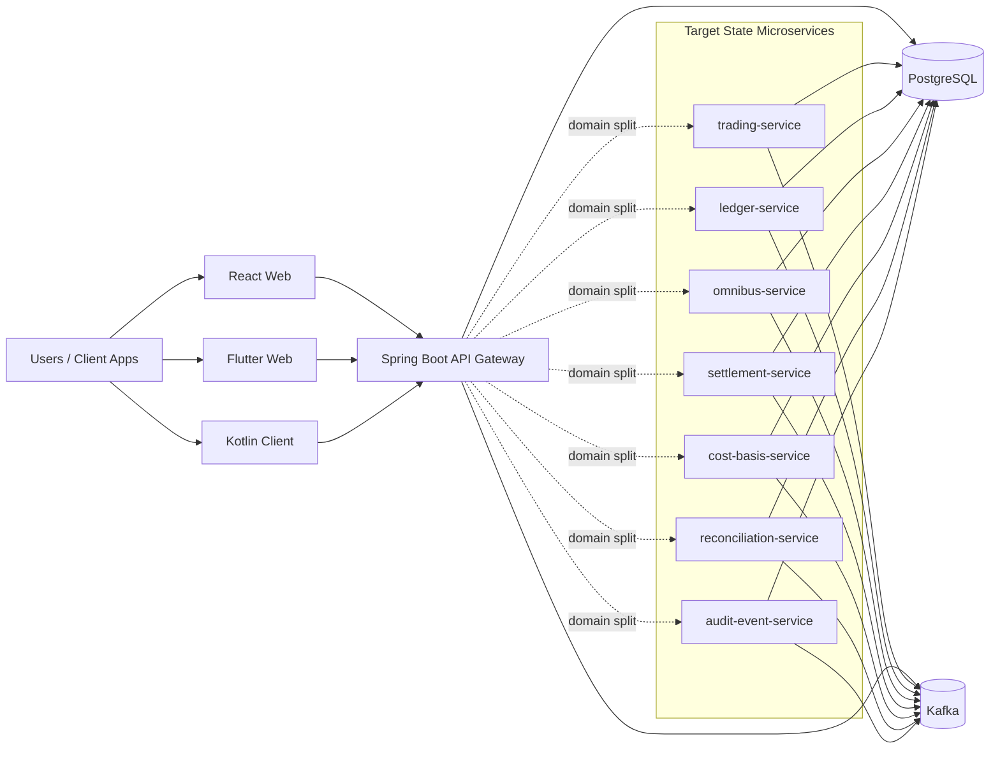

# ALL COMBINED README

This is the primary runbook for architecture, startup, validation, and deployment direction.

## Quick Script Reference

| Purpose | Command |
| --- | --- |
| Health check (host + container fallback) | `./scripts/health-check.sh 180 3` |
| Restart stack and verify health | `./scripts/restart-and-verify.sh 180 3` |
| Build all images | `./scripts/ci/build-images.sh` |
| Export target microservice images | `./scripts/ci/export-images.sh` |

## 1) High-Level Architecture



## 2) Local Startup

Core stack:

```bash
docker compose up -d
```

Optional clients:

```bash
docker compose --profile flutter --profile clients up -d flutter-web kotlin-client
```

Target microservice containers:

```bash
docker compose --profile algo-microservices build trading-service ledger-service omnibus-service settlement-service cost-basis-service reconciliation-service audit-event-service
docker compose --profile algo-microservices up -d trading-service ledger-service omnibus-service settlement-service cost-basis-service reconciliation-service audit-event-service
```

Health validation helper (host + in-container fallback):

```bash
./scripts/health-check.sh 180 3
```

Full restart + verify helper:

```bash
./scripts/restart-and-verify.sh 180 3
```

## 3) Test Validation

Run all tests:

```bash
mvn test
```

Current test set:

- `src/test/java/com/ptob/demo/controller/TradingControllerTest.java`
- `src/test/java/com/ptob/demo/service/RiskServiceTest.java`
- `src/test/java/com/ptob/demo/service/OmnibusServiceTest.java`

## 4) End-to-End API Smoke

```bash
TOKEN="Authorization: Bearer local-dev-token"
curl -X POST http://localhost:8080/api/demo/bootstrap -H "$TOKEN"
curl -X POST http://localhost:8080/api/trading/orders -H "$TOKEN" -H "Content-Type: application/json" -d '{"accountId":"trader-b","symbol":"BTC/USDT","side":"SELL","quantity":1,"price":45000,"idempotencyKey":"sell-e2e-1"}'
curl -X POST http://localhost:8080/api/trading/orders -H "$TOKEN" -H "Content-Type: application/json" -d '{"accountId":"trader-a","symbol":"BTC/USDT","side":"BUY","quantity":1,"price":45000,"idempotencyKey":"buy-e2e-1"}'
curl http://localhost:8080/api/trading/trades -H "$TOKEN"
```

## 5) Cloud Deployment Direction

AWS:

- Compute: EKS or ECS Fargate
- Database: RDS PostgreSQL
- Eventing: MSK Kafka
- Images: ECR

GCP:

- Compute: GKE or Cloud Run
- Database: Cloud SQL PostgreSQL
- Eventing: managed Kafka provider or Kafka on GKE
- Images: Artifact Registry

## 6) CI/CD

- Unit test workflow: `.github/workflows/ci.yml`
- Docker image workflow: `.github/workflows/docker-images.yml`
- Helper scripts: `scripts/ci/`

## 7) Operational Scripts

- `./scripts/health-check.sh 180 3` - retries host health and falls back to in-container health.
- `./scripts/restart-and-verify.sh 180 3` - restarts compose stack and runs health verification.
- `./scripts/ci/build-images.sh` - builds app, client, and target microservice images.
- `./scripts/ci/export-images.sh` - exports target microservice images to tar files.

## 8) Related Docs

- Docker image details: `RUN_DOCKER_IMAGES_README.md`
- Algorithm details: `PTO_CORE_ALGO_README.md`

## 9) Shutdown

```bash
docker compose down
```

